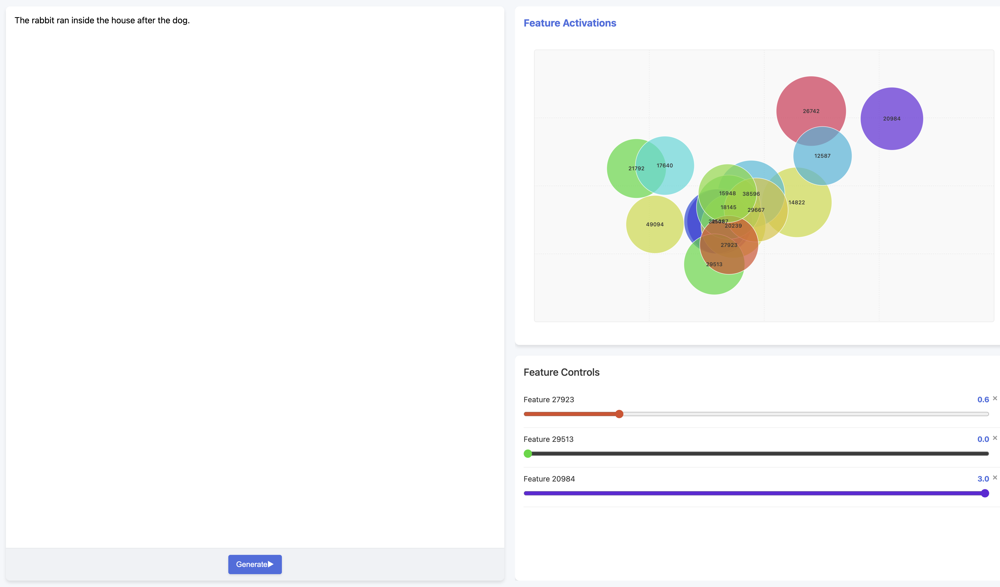

This repo trains a JumpReLU Sparse Autoencoder following [Conerly et al. (2025)](https://transformer-circuits.pub/2025/january-update/index.html) and allows a user to control text generation with it in a custom UI. This was heavily inspired by [LatentLit](https://x.com/trq212/status/1900227781117829532). The final feature would be autointerpretability to label the SAE features.



## Usage
```bash
git clone https://github.com/cheeetoo/sae.git
cd sae
uv sync
uv run app.py
```
